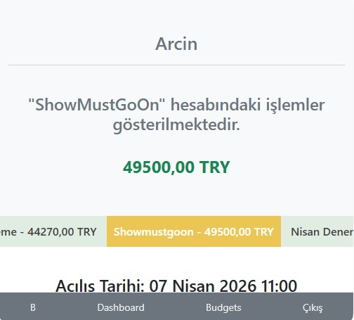
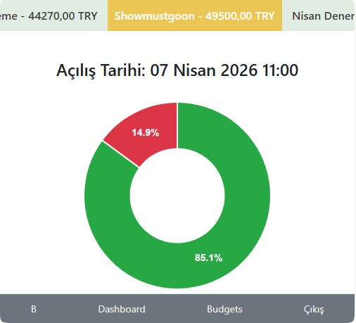
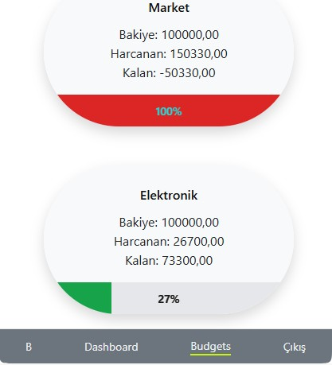
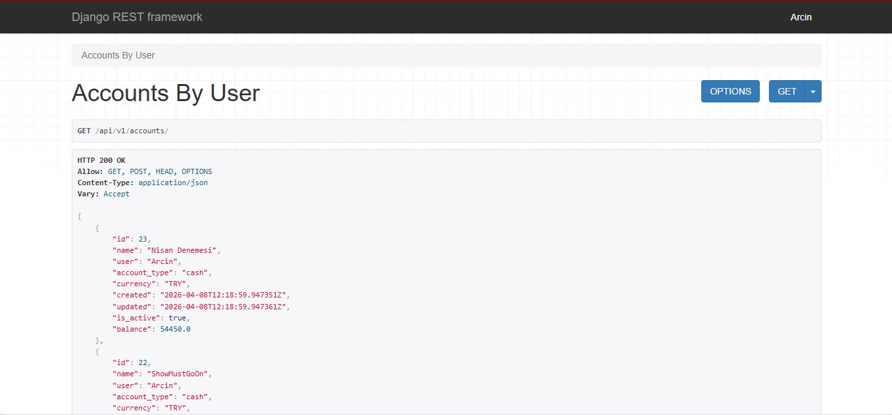
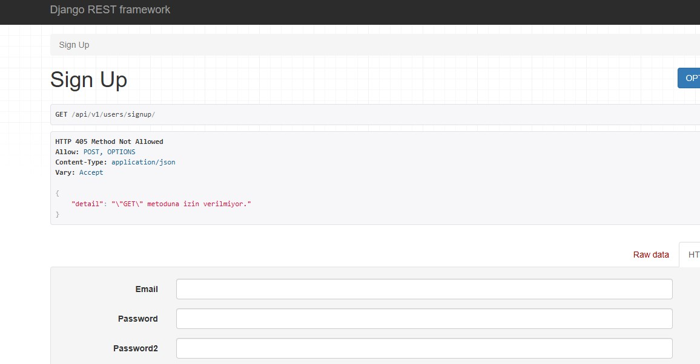

A Django-based finance application with a modular API architecture for managing accounts, balances, transactions and recurring transactions.

<!-- PROJECT LOGO -->
 

  

 

<!-- ABOUT THE PROJECT -->
## About The Project

A web page to trace your incomes and expanses. API features are provided.

(<a href="#readme-top">back to top</a>)

## 🛠 Tech Stack

- Backend: Django + Django REST Framework
- Frontend: HTML, CSS, Bootstrap, JavaScript
- Database: PostgreSQL
- API Design: Versioned REST API (`/api/v1/`)

(<a href="#readme-top">back to top</a>)

## ✨ Features

### ✅ Implemented
- User authentication (login/register/logout)
- Account listing with balances
- Dashboard overview
- Modular API layer (`api` app with versioning)
- Structured serializer distribution across domain apps
- Clean responsive UI (Bootstrap-based)

### 🚧 In Progress
- Add / Delete / Update transactions (UI integration ongoing)
- Account management (create/edit/delete via UI)
- Interactive charts (income vs expense visualization)

### 🔜 Planned
- Category-based budgeting
- Monthly financial reports
- Advanced analytics via API

(<a href="#readme-top">back to top</a>)

## 🧱 Architecture

The project follows a hybrid modular architecture:

### Core Apps
- `accounts/` → Account models & business logic
- `transactions/` → Transaction handling
- `budgets/` → Budget tracking

### API Layer
- `api/` → Centralized API control layer
  - `api/v1/views/` → All API views
  - `api/v1/urls/` → Versioned routing

### Serializers
- Serializers are kept inside their respective domain apps:
  - `accounts/serializers.py`
  - `transactions/serializers.py`

### Design Approach
- Separation of concerns:
  - Business logic → domain apps
  - API logic → centralized `api` app
- Scalable versioning strategy (`v1`, future `v2`)
- Clean and maintainable structure for growth

(<a href="#readme-top">back to top</a>)

## 🔌 API Overview

The project includes a versioned REST API.

### Base URL
/api/v1/

### Example Endpoints
- GET /api/v1/accounts/
- GET /api/v1/transactions/

### Notes
- API views are centralized under the `api` app
- Serializers are distributed across domain apps
- Designed for future frontend (React / mobile) integration

(<a href="#readme-top">back to top</a>)

## Demo

(<a href="#readme-top">back to top</a>)

## ⚙️ Installation

git clone https://github.com/yourusername/coder-finance.git
cd coder-finance

python -m venv venv
source venv/bin/activate  # Windows: venv\Scripts\activate

pip install -r requirements.txt

python manage.py migrate
python manage.py runserver

(<a href="#readme-top">back to top</a>)

## 📊 Current Status

The project is actively under development.

- ✅ API layer is implemented and functional
- ✅ Read operations (GET) are stable (UI + API)
- 🚧 Write operations (POST, PUT, DELETE) are in progress on UI side
- 🚧 Some UI features (add/delete/update) are not yet fully integrated

The backend architecture and API design are already production-oriented.

(<a href="#readme-top">back to top</a>)

## 🎯 Purpose

This project demonstrates:

- Scalable Django project architecture
- Separation of API and business logic
- RESTful API design with versioning
- Preparation for full frontend/API decoupling

(<a href="#readme-top">back to top</a>)

## 🚀 Future Improvements

- Full CRUD via UI and API
- Authentication via API (JWT)
- Interactive charts (Chart.js or similar)
- Frontend upgrade (React or HTMX)
- Deployment (Docker + cloud)

(<a href="#readme-top">back to top</a>)

<!-- CONTACT -->
## Contact

Nurettin Beşer - [https://www.instagram.com/zcodingsolutions/](https://www.instagram.com/zcodingsolutions/)

Project Link: [https://github.com/nbeser/BudgetProject/](https://github.com/nbeser/BudgetProject/)

Contributer : [https://github.com/nbeser](https://github.com/nbeser)

Linkedin : [https://www.linkedin.com/in/nurettin-beser-arcnbsr23](https://www.linkedin.com/in/nurettin-beser-arcnbsr23)

(<a href="#readme-top">back to top</a>)

